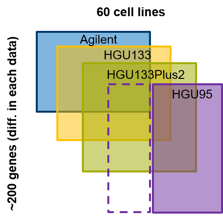
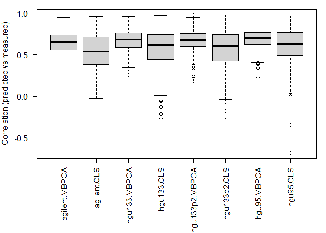
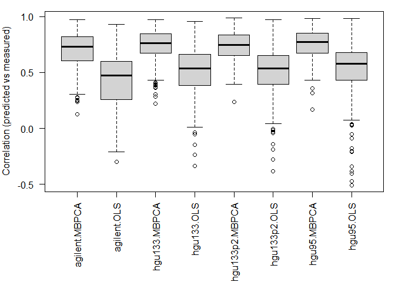
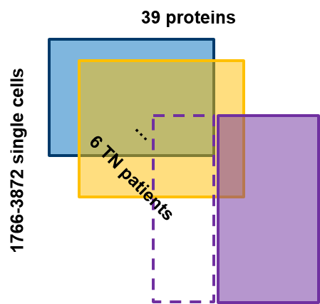
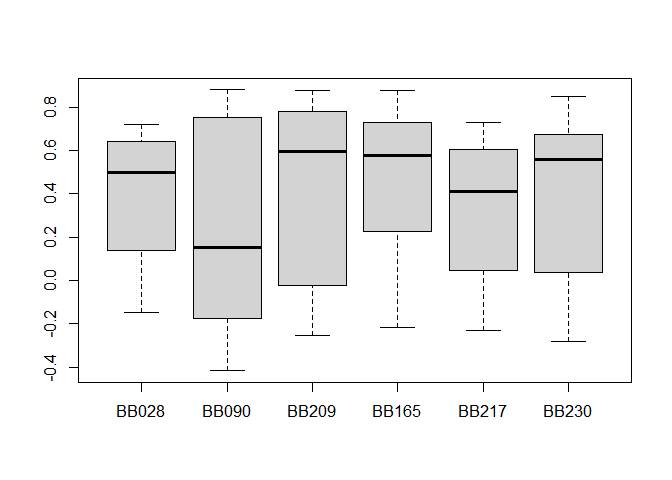
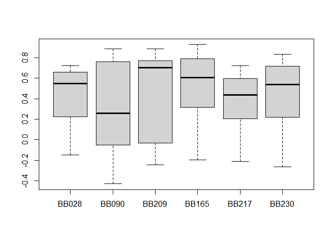

## Introduction
Partially overlapping data are often faced in the multi-omics data. For example, a cohort has been profiling using multiple omics technologies, however, every technology may only profile a subset of the cohort. We call this scenario as data with partial overlapping samples. In the data analysis, We may want to predict the missing samples in one omics dataset using the information from other omics datasets, where the samples are measured. Similarly, we may also interested in the data with partial overlapping features, e.g. genes or proteins, where all the samples are measured in all datasets, but the measured features may vary. In this vignette, we first briefly describe two methods that can be used to solve these problems, i.e. simple least square regression and multi-block principal component analysis (MBPCA). Next, we applied the two methods to solve the "missing sample" problem (using NCI60 transcriptomics data as an example) and missing feature problem (using mass-tag single-cell proteomics data). Finally, we will discuss the pros and cons of the methods and factors that may influence the prediction performance.

## The methods to solve the problem.
The most straightforward method to predict the missing feature or samples is simple linear regression. In this method, we train a linear model using the dataset where the samples/features to be predicted are measured. Then apply the model to predict the feature and sample. We implement this method in the  `pred_lm` function as below:


```r
pred_lm <- function(x, train.var, test.var, validation = c("row", "column")[1]) {
  xs <- lapply(x, function(x) as.data.frame(x[, train.var]))
  prd <- lapply(names(xs), function(m) {

    # predicting matrix - m
    prdmat <- setdiff(names(xs), m)

    rmat <- lapply(prdmat, function(mm) {
      # using matrix mm to predict
      sapply(test.var, function(tv) {
        df <- data.frame(y = x[[mm]][, tv], xs[[mm]])
        mod <- lm(y ~ ., data = df)
        predict(mod, xs[[m]])
      })
      })
    names(rmat) <- prdmat
    rmat$mean <- Reduce("+", rmat)/length(rmat)
    rmatz <- lapply(rmat, function(x) t(scale(t(x))))
    rmat$meanZ <- Reduce("+", rmatz)/length(rmat)

    ## correlation of predicted variable (test set)
    pred.cor.test <- sapply(rmat, function(mm) {
      if (validation == "row") {
        r <- sapply(1:nrow(x[[m]]), function(i) {
          cor(unlist(x[[m]][i, test.var]), mm[i, ])
        })
      } else {
        r <- sapply(1:ncol(mm), function(i) {
          cor(unlist(x[[m]][, test.var[i]]), mm[, i])
        })
      }
      r
    })
    list(predicted = rmat, cor.test = pred.cor.test)
  })
  names(prd) <- names(xs)
  prd
}
```
In this function, `x` a list of matrix/data.frame, `train.var` defines the training variables and `test.var` defines variable to be predicted. `validation` are whether on rows or on columns. The example of applying the function will come in the next section.

The second method that can solve the problem is multi-block principal component analysis (MBPCA). In regular PCA, we can project extra samples on the sample space of PCA [1]. When we have multiple omics data, the MBPCA can be used to find the coherent structure between datasets [2], and the missing samples in one of the datasets could be projects like regular PCA. This method is implemented in the `pred_mbpca` function.

```r
pred_mbpca <- function(x, train.var, test.var, ncomp = 2, method = "globalScore",
                       validation = c("row", "column")[1], ...) {

  x <- lapply(x, as.matrix)
  xs <- lapply(x, function(x) x[, train.var])
  rs <- mogsa::mbpca(x = xs, ncomp = ncomp, method = method, ...)
  nr <- rep(names(x), times = rs@tab.dim[1, ])

  lmats <- lapply(names(x), function(xx) {
    rs@loading[nr == xx, ]
  })
  names(lmats) <- names(x)

  prd <- lapply(names(lmats), function(m) {
    # predicting matrix - m
    prdmat <- setdiff(names(lmats), m)
    rmat <- lapply(prdmat, function(mm) {
      q <- t(x[[mm]]) %*% lmats[[mm]]
      mm <- q %*%  t(lmats[[m]])
      t(mm)
    })
    names(rmat) <- prdmat
    rmat$mean <- Reduce("+", rmat)/length(rmat)
    rmatz <- lapply(rmat, function(x) t(scale(t(x))))
    rmat$meanZ <- Reduce("+", rmatz)/length(rmat)

    ## correlation of predicted variable (train set)
    pred.cor.train <- sapply(rmat, function(mm) {
      if (validation == "row") {
        r <- sapply(1:nrow(x[[m]]), function(i) {
          cor(x[[m]][i, train.var], mm[i, train.var])
        })
      } else {
        r <- sapply(1:length(train.var), function(i) {
          cor(x[[m]][, train.var[i]], mm[, train.var[i]])
        })
      }
      r
    })

    ## correlation of predicted variable (test set)
    pred.cor.test <- sapply(rmat, function(mm) {

      if (validation == "row") {
        r <- sapply(1:nrow(x[[m]]), function(i) {
          cor(x[[m]][i, test.var], mm[i, test.var])
        })
        # r <- sapply(1:nrow(x[[m]]), function(i) {
        #   cor(unlist(x[[m]][i, test.var]), mm[i, ])
        # })
      } else {
        r <- sapply(1:length(test.var), function(i) {
          cor(x[[m]][, test.var[i]], mm[, test.var[i]])
        })
      }
      r
    })

    list(predicted = rmat, cor.train = pred.cor.train, cor.test = pred.cor.test)
  })
  names(prd) <- names(lmats)
  prd
  }
```
Again, the application of the function will come later section. A simple description of the parameters:
`x` a list of matrix/data.frame;
`train.var` the training variables;
`test.var` the variables to be predicted;
`ncomp` the number of components to calculate;
`method` the deflation method;
`validation` in the validation step, whether the correlation of rows or columns should be calculated;
`...` other parameters passed to `mbpca`.
The `ncomp`, `method` and `...` method are documented in the function `mbpca` in *`mogsa`* package.

## Partially overlapping samples
In this application, we have four microarray experiments that measured the gene expression of 60 cell lines (NCI-60). Every microarray datasets contain ~200 genes expression (rows; figure below).



Among them, let's assume that the HGU95 platform has a few cell lines missed now we want to predict the gene expression in missing samples in the HGU95 platform. First, we need to load the required package and datasets


```r
library(mogsa)
library(omicade4)
```

```
## Loading required package: ade4
```

```
## Warning: package 'ade4' was built under R version 4.0.2
```

```r
data("NCI60_4arrays")
```

Indeed, in the `NCI60_4arrays` data, all four datasets have measured all 60 cell lines. But we can randomly partition our data to the training data (the samples measured in all datasets) and testing data (the samples not measured in HGU95 and will be predicted). To validate our prediction, we can correlate the predicted value with the measured values. First, let's use 40 cell lines in training and 20 for testing.


```r
set.seed(18)
ss <- sample(1:60, size = 40)
v <- pred_mbpca(x = NCI60_4arrays, train.var = ss, test.var = setdiff(1:60, ss), ncomp = 5, method = "globalScore")
```

```
## calculating component 1 ...
## calculating component 2 ...
## calculating component 3 ...
## calculating component 4 ...
## calculating component 5 ...
```

```r
v2 <- pred_lm(x = NCI60_4arrays, train.var = ss, test.var = setdiff(1:60, ss))

# geth mean MZ
t1 <- lapply(v, function(x) x$"cor.train"[, "meanZ"])
t2 <- lapply(v, function(x) x$"cor.test"[, "meanZ"])
l <- mapply(function(x,y) {
  list(MBPCA = x, OLS = y)
}, t1, t2, SIMPLIFY = FALSE)
l <- unlist(l, recursive = FALSE)
par(mar = c(8, 4, 1, 1))
boxplot(l, las = 2, ylab = "Correlation (predicted vs measured)")
```

<!-- -->

```r
####
```

Next, we use 20 samples for training and 40 samples for testing

```r
ss <- sample(1:60, size = 20)
v <- pred_mbpca(x = NCI60_4arrays, train.var = ss, test.var = setdiff(1:60, ss), ncomp = 5, method = "globalScore")
```

```
## calculating component 1 ...
## calculating component 2 ...
## calculating component 3 ...
## calculating component 4 ...
## calculating component 5 ...
```

```r
v2 <- pred_lm(x = NCI60_4arrays, train.var = ss, test.var = setdiff(1:60, ss))


t1 <- lapply(v, function(x) x$"cor.train"[, "meanZ"])
t2 <- lapply(v, function(x) x$"cor.test"[, "meanZ"])
l <- mapply(function(x,y) {
  list(MBPCA = x, OLS = y)
}, t1, t2, SIMPLIFY = FALSE)
l <- unlist(l, recursive = FALSE)

par(mar = c(8, 4, 1, 1))
boxplot(l, las = 2, ylab = "Correlation (predicted vs measured)")
```

<!-- -->
We can see that
1. the MBPCA methods generally perform better than the simple linear regression;
2. the performance of linear regression drops more dramatically compared to MBPCA when the size of the training set decreases.

## Partially overlapping features
In this application, we work with the *mass tag* proteomics data provided in the [sc-targeted-proteomics section](https://github.com/BIRSBiointegration/Hackathon/tree/master/sc-targeted-proteomics). The expression of 39 proteins was measured on single-cell resolution among 6 patients with triple-negative tumors (Figure below).



We now assume that some of the proteins in the purple patients are not measured, we want to know could we reliably predict the expression of the missing proteins in the purple patients. First, we load the package and datasets needed


```r
library(mogsa)
library(stringr)
library(SummarizedExperiment)
```

Preparing data for the analysis

```r
load("masstagSCE.rda")

dat <- livecells.sce
meta <- as.data.frame(colData(dat), stringsAsFactors = FALSE)
# select the TN tumors
i <- which(meta$Clinical.Subtype == "TN")
features <- as.data.frame(rowData(dat))
expr <- assay(dat)
rownames(expr) <- make.names(rownames(expr))
# rescale the data
pt <- as.character(unique(meta$patient_id.x[i]))
exprlist <- lapply(pt, function(v) {
  scale(t(expr[, meta$patient_id.x == v]), center = TRUE, scale = TRUE)
})
names(exprlist) <- pt
sapply(exprlist, nrow)
```

Predicting the missing proteins using MBPCA

```r
######
s.train <- sample(1:ncol(exprlist[[1]]), size = 25)
s.test <- setdiff(1:ncol(exprlist[[1]]), s.train)
v <- pred_mbpca(
  x = exprlist, train.var = s.train, test.var = s.test, ncomp = 7,
  method = "blockLoading", center = FALSE, validation = "column"
)
```

```
## calculating component 1 ...
## calculating component 2 ...
## calculating component 3 ...
## calculating component 4 ...
## calculating component 5 ...
## calculating component 6 ...
## calculating component 7 ...
```

```r
meanz <- lapply(v, function(x) x$cor.test[, "meanZ"])
boxplot(meanz)
```

<!-- -->

Predicting the missing proteins using simple linear regression

```r
v2 <- pred_lm( x = exprlist, train.var = s.train, test.var = s.test, validation = "column" )
meanz2 <- lapply(v2, function(x) x$cor.test[, "meanZ"])
boxplot(meanz2)
```

<!-- -->

In this case, the MBPCA has a similar performance compared to simple linear regression.

## Disussion
In this exercise, we have applied MPBCA and simple linear regression to partially overlapping features or sample questions. In fact, the only difference between the two questions depends on how the matrices are transposed. We may expect MBPCA outperforms simple linear regression because the former finds the correlated pattern across multiple datasets, preventing the potential problem of overfitting to one dataset. But this is only the case for the question of partially overlapping samples. This may because the MBPCA was originally developed as a method to integrate multiple omics datasets where different variables (features) measured on the same set of samples (similar to "partial overlapping samples question"). In practice, these data are often normalized in a way that the variable distributions are comparable between samples (column). As a result, in MBPCA, we can directly center/scale each variable so that the divergence among samples is highlighted. However, scenario 2 treats proteins as samples and individual cells as variables. However, the overall abundances of different proteins are different in orders of magnitude, leading to highly correlated variables after scaling/centering. The accuracy of prediction is negatively influenced by the collinearity of scale variables.

Other remarks
* two other categories of methods, multiple-factorial analysis and partial least square, could also be applied to solve the question, but I haven't got the time to include all of them in the evaluation, and they share the same problems as MBPCA which I will discuss in the next point.
* MBPCA is also 10-100 times faster than linear regression methods.

Potential improvement
We have tried to scale the protein expression and it improves the prediction accuracy. I believe there are more spaces to improve by applying different preprocessing or different metrics to transform the data. A starting point of the next step would try to transform the values to marginal probabilities as in correspondence analysis.

## References
[1] Abdi, Herve, and Lynne J. Williams. n.d. "Principal Component Analysis." https://doi.org/10.1002/wics.101.

[2] Meng, Chen, Dominic Helm, Martin Frejno, and Bernhard Kuster. 2016. "moCluster: Identifying Joint Patterns Across Multiple Omics Data Sets." Journal of Proteome Research 15 (3): 755-65.

## session information

```r
sessionInfo()
```

```
## R version 4.0.0 (2020-04-24)
## Platform: x86_64-w64-mingw32/x64 (64-bit)
## Running under: Windows 10 x64 (build 18362)
## 
## Matrix products: default
## 
## locale:
## [1] LC_COLLATE=English_United States.1252 
## [2] LC_CTYPE=English_United States.1252   
## [3] LC_MONETARY=English_United States.1252
## [4] LC_NUMERIC=C                          
## [5] LC_TIME=English_United States.1252    
## 
## attached base packages:
## [1] parallel  stats4    stats     graphics  grDevices utils     datasets 
## [8] methods   base     
## 
## other attached packages:
##  [1] SingleCellExperiment_1.10.1 SummarizedExperiment_1.18.2
##  [3] DelayedArray_0.14.1         matrixStats_0.56.0         
##  [5] Biobase_2.48.0              GenomicRanges_1.40.0       
##  [7] GenomeInfoDb_1.24.2         IRanges_2.22.2             
##  [9] S4Vectors_0.26.1            BiocGenerics_0.34.0        
## [11] stringr_1.4.0               omicade4_1.28.2            
## [13] ade4_1.7-15                 mogsa_1.21.0               
## 
## loaded via a namespace (and not attached):
##  [1] Rcpp_1.0.4.6           lattice_0.20-41        corpcor_1.6.9         
##  [4] gtools_3.8.2           digest_0.6.25          R6_2.4.1              
##  [7] backports_1.1.7        RSQLite_2.2.0          evaluate_0.14         
## [10] httr_1.4.1             gplots_3.0.3           zlibbioc_1.34.0       
## [13] rlang_0.4.6            svd_0.5                made4_1.61.0          
## [16] annotate_1.66.0        gdata_2.18.0           blob_1.2.1            
## [19] Matrix_1.2-18          checkmate_2.0.0        rmarkdown_2.3         
## [22] splines_4.0.0          RCurl_1.98-1.2         bit_1.1-15.2          
## [25] compiler_4.0.0         xfun_0.16              htmltools_0.5.0       
## [28] GenomeInfoDbData_1.2.3 XML_3.99-0.3           MASS_7.3-51.6         
## [31] bitops_1.0-6           rappdirs_0.3.1         grid_4.0.0            
## [34] xtable_1.8-4           GSEABase_1.50.1        DBI_1.1.0             
## [37] magrittr_1.5           graph_1.66.0           KernSmooth_2.23-17    
## [40] stringi_1.4.6          XVector_0.28.0         genefilter_1.70.0     
## [43] graphite_1.34.0        vctrs_0.3.0            tools_4.0.0           
## [46] bit64_0.9-7            survival_3.1-12        yaml_2.2.1            
## [49] AnnotationDbi_1.50.0   cluster_2.1.0          caTools_1.18.0        
## [52] memoise_1.1.0          knitr_1.29
```

